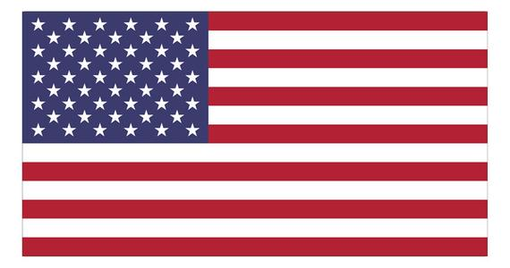

Greetings everyone!

This challenge of CSS Drawing is to draw The Flag of United States Of America.

Concepts to be used:  
Border properties, padding, border-styling, before and after attributes, box-Shadow, position property and the calc() function for calculating the height of each stripe in the flag of USA

The USA flag has 13 stripes, 7 red stripes and 6 white, of equal height and width. One easy way to create this with CSS is to set the background to white and add 7 red stripes evenly spaced. 

The USA flag has 50 stars broken into 9 rows that alternate between 6 stars and 5 stars per row. For both types of rows, we need to space each star out evenly across the container. So keep that in mind.

So buckle up and get started!!

For Reference the Flag of USA is shown below.
		
