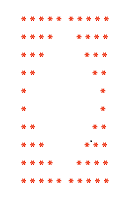

## HOLLOW DIAMOND INSCRIBED IN A RECTANGLE

This challenge will help you to think the logic in a way so that you can use a loop and conditional statements to have certain breakpoints and get the desired results.

### Challenge: 

So in this challenge you have to write a program to print a pattern of the shape of hollow diamond inscribed in a rectangle. 
When you input a number based on those 4 triangles in different orientations should be made such that the overall result should be that of output shown below.

Input: 5

Output:
     
