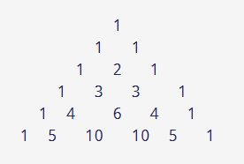

## PRINT PASCAL’S TRIANGLE

This challenge will help you to think the logic in a way so that you can use a loop and conditional statements to have certain breakpoints and get the desired results.

PASCAL’S TRIANGLE:
Pascal's triangle is a triangular array of the binomial coefficients. In much of the Western world, it is named after the French mathematician Blaise Pascal. To build the triangle, start with "1" at the top, and then continue placing numbers below it in a triangular pattern.

### Challenge: 

So in this challenge you have to write a program to print a pattern of the famous PASCAL TRIANGLE. 
When you input the number of rows to be printed it will print the triangular pattern for that many rows as shown in the sample.

Input: 6

Output:
     
