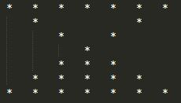

# Day - 7
---
## Making a Pattern
 &nbsp;
 
This challenge will help you to think how you can use a simple for loop and some conditional statements to make your desired pattern
### Challenge -
So in this challenge you have to Write a program to print a upside buterfly shape made up of stars(*) but with a twist --- 
You have to take the number of rows as an input from the user and will have to print the pattern as shown in example

#### Note -- The input will always be a odd number(think why?).
##### Example -
<pre>input - 7
output -  </pre>            
