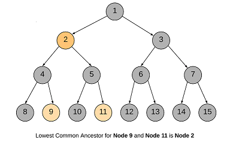

## LOWEST COMMON ANCESTOR OF A BINARY TREE

### Challenge
Given a binary tree (not a binary search tree) and two values say n1 and n2, write a program to find the least common ancestor.

Output:
	  

Here the lowest common ancestor of 9 and 11 is 2.

