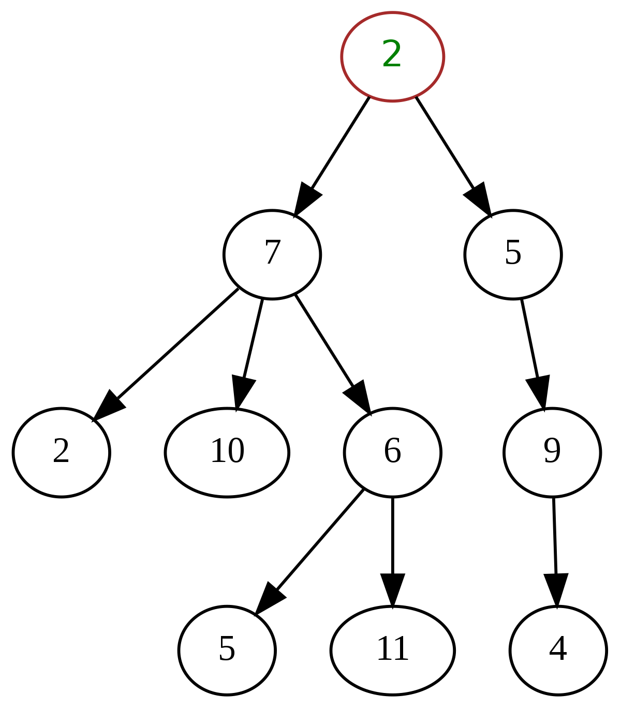

 # Day - 79
---
## Generic Tree Data Structure --
A Generic Tree is a Data Structure which is widely used for storing hierarchical data.
In Generic Tree each node can have any number of children nodes. 

## Challenge -- Implementation of Generic Tree -- 
1. User will provide you with a number n(i.e size of an array).
2. Now the user will give an array of n numbers.
3. First element of array to be consider as root node.
3. Here each -1 will mean the node ends there and move to your parent node.
4. Any number other than -1 is to be consider as a node.
5. Now you have to write following functions to implement generic tree --- 
    
    construct(arr) -- It will construct a generic tree from the array provided by the user and will return a root node to be used for  other operations of generic tree. 
    display(root)  -- It will display the generic tree with each node and it's childs.
    size(root) -- This function counts the number of nodes in the tree and return it.

### Note - (Plese refer to resources to read more about Tree Data Structure and Generic Tree).

#### Hints and Instructions: 
1. Use an Array as the base storage for storing elements of Queue.
2. Please try to remember how we implemented Stack DS using Array.
#### Examples to check working of your Stack -- 
If you have made a class names CustomStack, then after performing the following operations the output should be -- 
<pre> 
 Input -- 
 12
 10 20 -1 30 50 -1 60 -1 -1 40 -1 -1   

<b>Output - (After display function)</b> 
10 -> 20,30,40,.
20 -> .
30 -> 50,60,.
50 -> .
60 -> .
40 -> .
</pre>