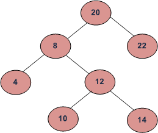

## LOWEST COMMON ANCESTOR OF A BINARY SEARCH TREE

### Challenge
Given a binary search tree and two values say n1 and n2, write a program to find the least common ancestor.

Output:
	  

Here the least common ancestor of 10 and 14 is 12. 
Similarly the least common ancestor of 8 and 10 is 8.

