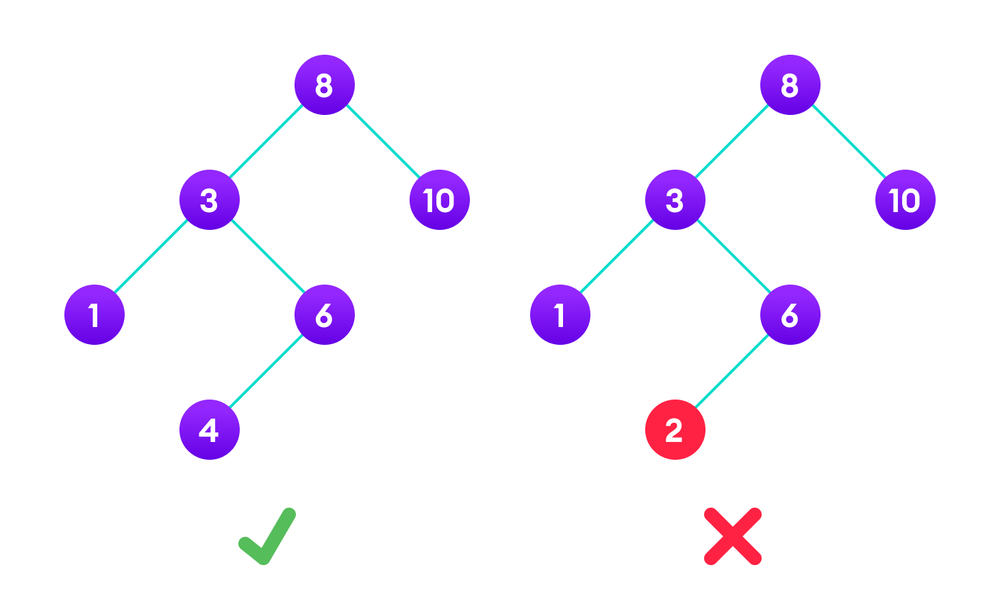

 # Day - 91
---
## Binary Search Tree  --
The most commonly used and one of the most efficient Data Structure for the searching.

## Challenge -- Implementation of BST Class-- 
1. You have to make a Binary Search Tree class which will have following functions --- 
<b>The name of class is BST.</b>
    insert(data)  -- Add the data into the Binary Tree.
    inOrder(root) -- It will print the elements of BST in Inorder traversal way.
    display(root) -- It will display the Tree.(It is managed for you so just write abouve two functions.) 

### Note - (Plese refer to resources to read about Binary Search Tree before starting the challenge).

<pre> 
 Input -- 
var tree = new BST();
tree.insert(10);
tree.insert(60);
tree.insert(70);
tree.insert(50);
tree.insert(20);
tree.insert(30);
tree.insert(6);
tree.display(tree.root);
tree.inOrder(tree.root);  

<b>Output - (After running max function and traversal function)</b> 
After display -- 
6 <- 10 -> 60
. <- 6 -> .
50 <- 60 -> 70
20 <- 50 -> .
. <- 20 -> 30
. <- 30 -> .
. <- 70 -> .
Inorder Traversal -- 
6
10
20
30
50
60
70
</pre>