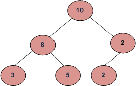

## Children Sum Property

### Challenge
Given a binary tree, write a function that returns true if the tree satisfies below property.
For every node, data value must be equal to sum of data values in left and right children. Consider data value as 0 for NULL children. Below tree is an example

Output:
	  

