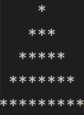

## Day 2
---
### Making a Pyramid Pattern

For this challenge, you have to create a pyramid pattern (of any size) using a 'for' loop.
So, the time complexity will be O(n).

For example, if the number of rows is 5, the pattern should be:
  
