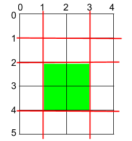

## Day 29
---
### Maximum area of a piece of cake

For this challenge, consider you were given a rectangular cake with height 'h' and width 'w', and two array of integers 'horizontalCuts' and 'verticalCuts', where 'horizontalCuts[i]' is the distance from the top of the rectangular cake to the 'ith' horizontal cut and similarly, 'verticalCuts[j]' is the distance from the left of the rectangular cake to the 'jth' vertical cut.

You have to return the maximum area of a piece of cake after you cut at each horizontal and vertical position provided in the arrays 'horizontalCuts' and 'verticalCuts'.

**Hint:** Since the answer can be a huge number, return its modulo 10^9 + 7

Example: h = 5, w = 4, horizontalCuts = [1, 2, 4], verticalCuts = [1, 3]
