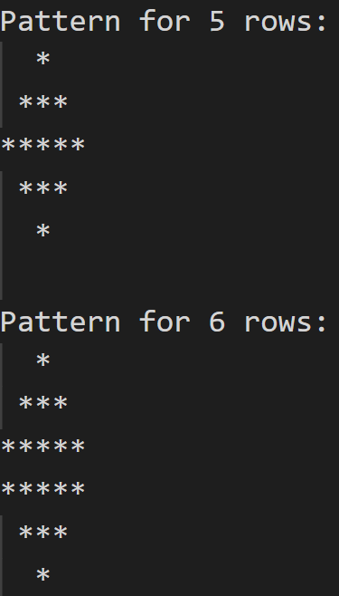

## Day 5
---
### Making a Diamond Pattern

For this challenge, you have to create a diamond pattern (of any size) using nested 'for' loop.
So, the time complexity will be O(n^2).

For example, the pattern should be:
&nbsp;
  
