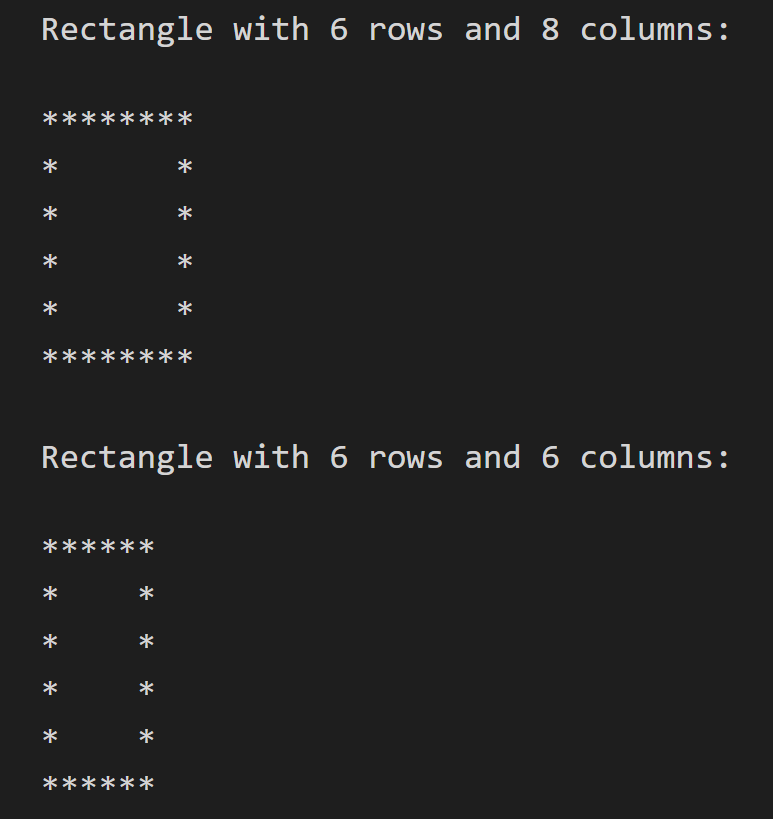

## Day 8
---
### Making a Rectangle (Border) Pattern

For this challenge, you have to create a rectangle pattern (of any size) using nested 'for' loop.
So, the time complexity will be O(n^2). For example, if the number of rows is 5, the pattern should be:
  
