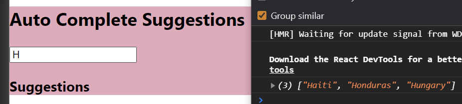

### Day 44
---
In this mini task, you are going to make a auto complete suggestions for a typed text in the input box.  

### Funtionality
Now you are going to implement the key functionality i.e., on typing the name, the suggestion words should be displayed in the suggestions div. From the previous challenge you must have created state parameters to track text input, suggestions array and list of countries in a sort order.

### Code Requirements
1. Write the event handler for the input on changing it. 
2. The event handler should set the state's text to be current entered input, and based on that should change the suggestions array.
3. You can match the given word as a prefix for the countries list using regex expression in javascript (https://www.w3schools.com/JSREF/jsref_regexp_test.asp). 
4. Print the suggestions in the console for your cross check.

### Output
