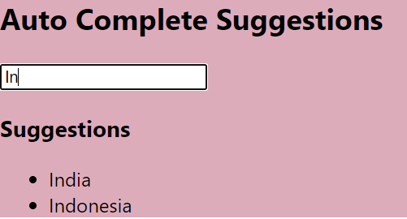

### Day 45
---
In this mini task, you are going to make a auto complete suggestions for a typed text in the input box.  

### Funtionality
Display the suggestions in the order as a list in the display.

### Code Requirements
1. In the render component, using map, lists and keys, create a jsx const which contains the Mapping to each item in the suggestions.
2. Now display the map in the ul component. 

### Output
