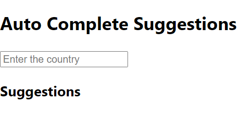

### Day 54
---
In this mini task, you are going to make a auto complete suggestions for a typed text in the input box.  

### Funtionality
It should have 3 sections for the heading, input holder, Suggestions div.
Import the data.js file into the code.

### Code Requirements
1. Create a class component with necessary fields in the state for the following functionalities
    * For the changing input, suggestions should change
    * The suggestions should be in lexicographically increasing order   
    * Change of input in input holder should be tracked
2. Style the 3 different components to make them attractive. 

### Output
