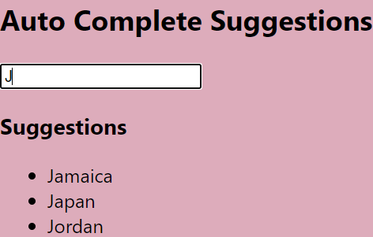
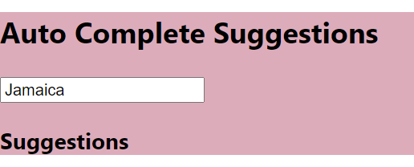

### Day 45
---
In this mini task, you are going to make a auto complete suggestions for a typed text in the input box.  

### Funtionality
Onclicking on the suggestions, the input should become the selected text and the suggestions should be empty.

### Code Requirements
1. Implement the previosly written map code for list of suggestions to a function.
2. OnClicking the item in the list, the state should be changed according to the given functionality.

### Output
1. #### Before clicking the link for the Jamaica

2. #### After clicking the link for the Jamaica
