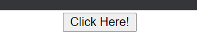
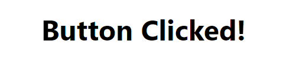

### Day 12
---
In this challenge you are conditionally going to render the components.

#### Functionalities 
1. Initially only button is present.
2. On a button click the component will be changed to the text "Button Clicked!"

#### Code requirements
1. Create a class component with state tracking if the button is clicked.
2. Write event handler for the button click.
3. Conditionally render either button or the text based on the state.

#### Output should look like
1. ##### Before Click
 
2. ##### After Click
 