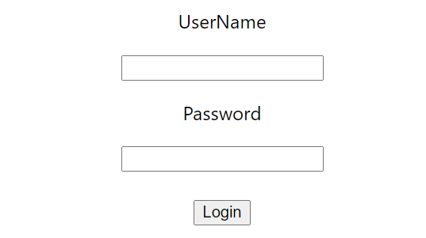
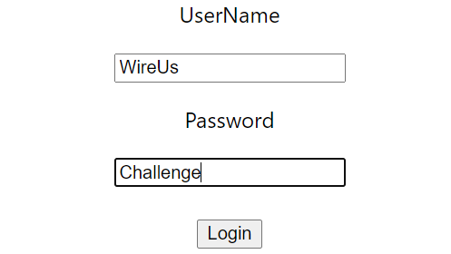

### Day 12
---
Today we are going to do the form submission challenge using the concepts that we have learnt already. 

#### Functionalities 
1. User can enter username and password
2. User can submit the form by button click
3. After submiting the form, that should display a message "Your form has been submitted succesfully!"
4. Cross check if your input has saved in state by displaying it console.

#### Code requirements
1. Form should be a class component with state having username and password.
2. Create separate even handlers for each input and for the form submission.
3. Conditionally render the form if not submitted. 
4. After submitting the form display the message

#### Output should look like
1. ##### Form
  

2. ##### Handle the Input
 
 
3. ##### Reponse
 