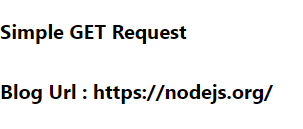

### Day 49
---
In this challenge you will make a simple get request.  

### Get request using fetch
You are going to make a get request from the github api and display the blog url of nodejs org.

### Code Requirements
1. Using fetch you need to make a post request to 'https://api.github.com/orgs/nodejs'.
2. Check the contents of the data in the console.
3. Store the blog url in the state.
3. Display the blog url of the given org using state. 

### Output
