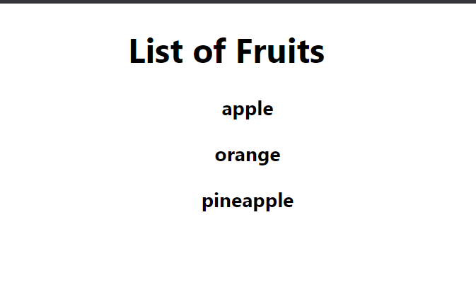

### Day 16
---
This challenge will introduce you to render the component as a list using map function.

#### Functionalities 
1. The display will be the list of fruits using map function. 

#### Code requirements
1. Create a class component with state as list of fruits.  
2. Use a map function to assign the <li> elements to a const with the key as fruit name.
3. Render the fruits list inside the <ul> element

#### Output should look like
