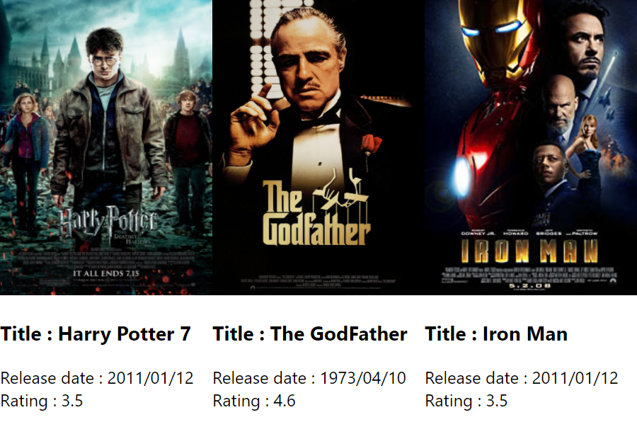

### Day 40
---
Movies display challenge using Map. In this challenge you are going to display the movies list. 

#### Code Requirements
1. Create a class component, import the movie data and store it in the state. 
2. Map all the list of movies to a jsx object (Refer Lists and keys challenge) in render.
3. While returning this component, include that list of jsx objects.  
3. Add custom styling to the div so that all the movies are aligned in a row.

#### Output
