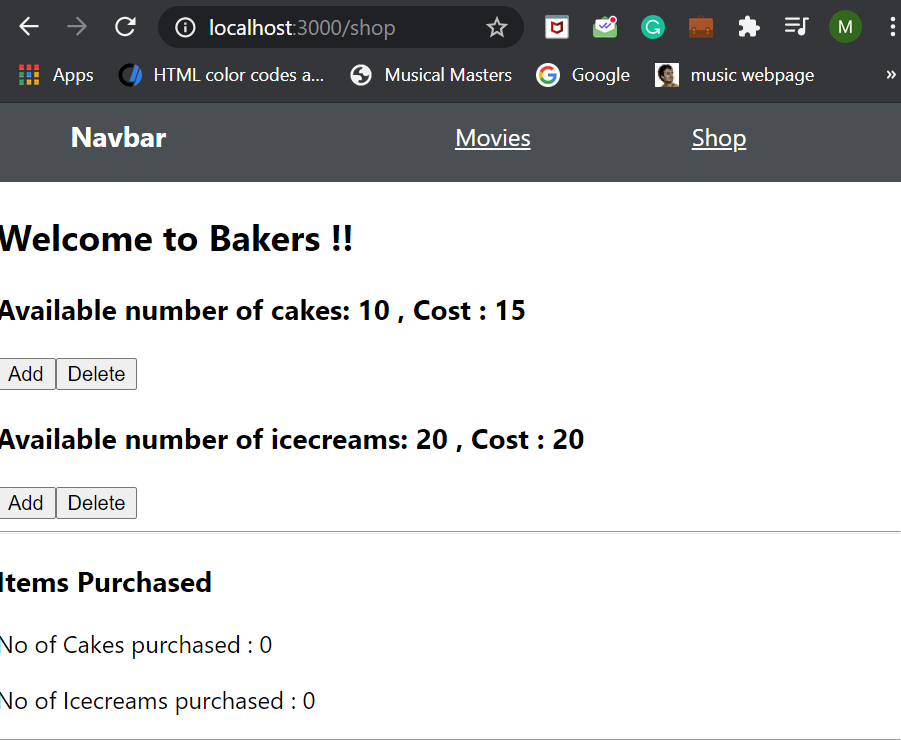

### Day 43
---
In this challenge you will implement to link the router components.

#### Functionalities 
OnClicking the links in the navbar, you should be navigated to the different component and the link must also be changed. 

#### Code requirements
1. Using "Link to=", specify the path for the <li> components in navbar. This path should be same as the path that is specified for the Route.
2. This "Link to=" tags must be enclosed in a BrowserRouter tag.

#### Output
1. #### Before clicking links in navbar

2. #### After clicking Movies link in navbar

3. #### After Clicking Shop link in navbar
