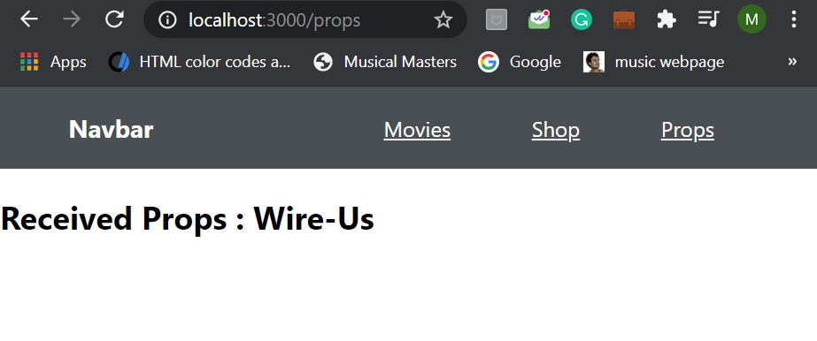

### Day 46
---
In this challenge you will implement routing components with a callback function.

### Functionalities
OnClicking the props, the passed props from the route should be displayed in the component you created in the previous challenge. 

#### Code requirements
1. Include another route in the navigation, with "component" as a callback function.
2. The callback function should include the created component with prop as "name" having value of your choice.
3. Add this to the links in the navbar with path to "/props". 

#### Output
