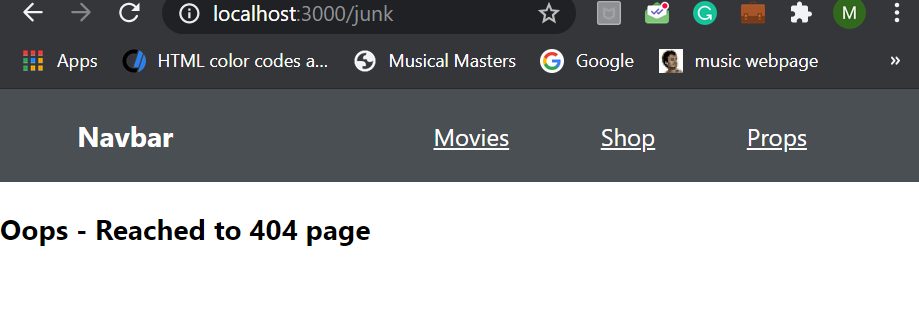

### Day 45
---
In this challenge you will handle non-specified routes.

#### Code requirements
1. Create a functional or class component for 404 page.
2. Include the route with no path mentioned and component as the created one in the previous step.
3. This ensures that if any path is not matched, the 404 page will be diplayed.

#### Output 

