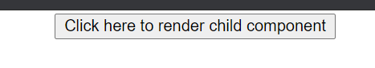

### Day 16
---
In this challenge you are going to render child component in the parent component.

#### Functionalities 
1. Contains a button which handles event onClick
2. On the button click the child component is rendered

#### Code requirements
1. Create a Parent class component with state as "clicked".  
2. Create a Child class component which accepts the props "name".
4. On the button click, the child component should be rendered using the props passed.

#### Output should look like

