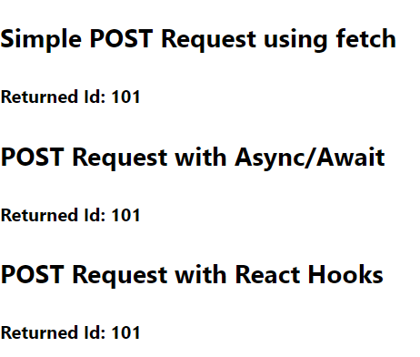

### Day 40
---
These series of challenges will introduce you to make post requests in different methods.  

### Api request using Hooks method
You are going to make a post request to a fake api and return the response from that. The response returned should be stored in state nd print it as a display. Go through the blog https://www.robinwieruch.de/react-fetching-data to get the idea about requests.

### Code Requirements
1. Using react hooks you need to make a post request to 'https://jsonplaceholder.typicode.com/posts'
2. The body should consists of json object with parameters as title.
3. Record the response and print it in the display. (Access the response using state).
4. Generally api requests are made in componentDidMount() method. 

### Output
