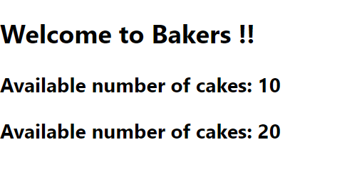

### Day 31
---
In this challenge your going to build state components for a bakery shop.

#### Functionalities 
The website of a bakery shop should display the bakery name and available no of items in each variety.

#### Code requirements
1. Create a class component with state as the items in bakery with their availability number.

#### Output should look like
