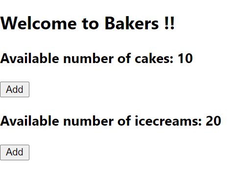

### Day 31
---
In this challenge your going to create button and handle the events.

#### Functionalities 
1. Each item in the bakery should contain a button to click. 

#### Code requirements
1. Create "Add" button to each item.
2. Handle events like onClick for those buttons (prefarably only one handleClick for all the items).
3. On "Add" - should decrease the availability of that item by 1. 

#### Output should look like

1. ##### Display the items

2. ##### After clicking add button for icecreams
