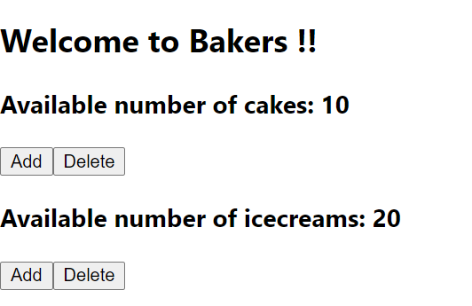
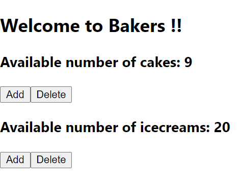
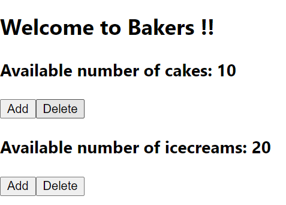

### Day 35
---
In this challenge your going to create button and handle the events.

#### Functionalities 
Each item in the bakery should contain a button to click and handle delete funtion. Basically we are making a add to cart functionality. On adding to our cart the no of items in shop should decrease and on deleting from cart, the no of items should increase in bakery. 

#### Code requirements
1. Create "Delete" button to each item.
2. Handle events like onClick for those buttons (prefarably only one handleClick for all the items).
3. On "Delete" - should increment the no of items 

#### Follow UP 
Don't worry if the increment function is increasing your no of items more than initial no of items. We are going to handle it in next challenge.

#### Output should look like

1. ##### Display the items with add and delete button

2. ##### After clicking Add button for cakes

3. ##### After clicking Delete button for cakes
