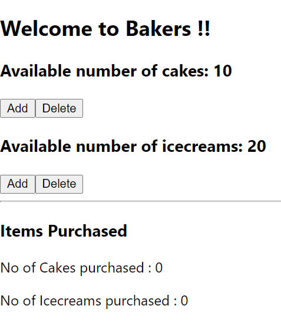
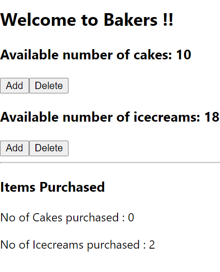
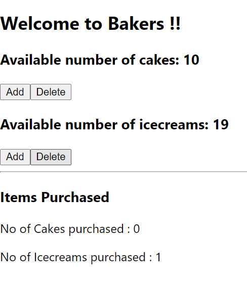

### Day 36
---
In this challenge you are going to keep track of no of items purchased for each variety available in bakery.

#### Functionalities 
On clicking the Add button for a specified item, both the no of items in the bakery and no of items you have purchased should be updated. Same applies for Delete button. Take care that the items you purchased for a variety should not cross the intial bouundary of that variety. And you cant add more than the available items in your cart.

#### Code requirements
1. Create variables in state to track the no of items of each variety and initialize them to 0.
2. In the event handlers manage the no of items you have purchased
3. Write conditions for edge cases.

#### Output should look like

1. ##### Display the items with add and delete button

2. ##### After clicking Add button for icecreams (2 times)

3. ##### After clicking Delete button for icecreams (1 time)
