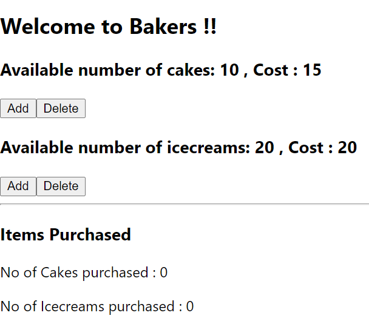

### Day 37
---
In this challenge you are going to display the cost of each variety. 

#### Functionalities 
We should be able to see the cost of each variety besides the no of items for each variety.

#### Code requirements
1. Create variables in state that has the cost of each variety.
2. Display the cost of each variety using the state variable.

#### Output should look like

##### Display
