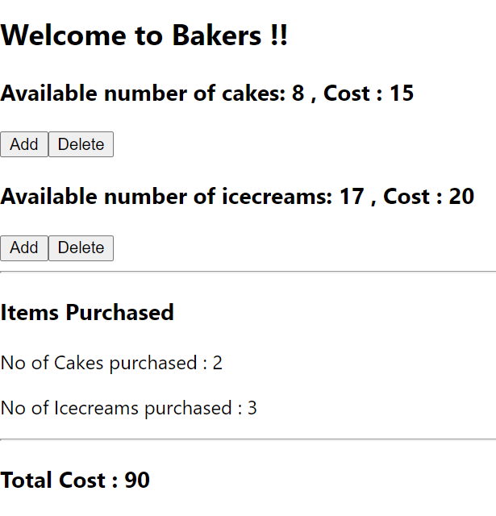
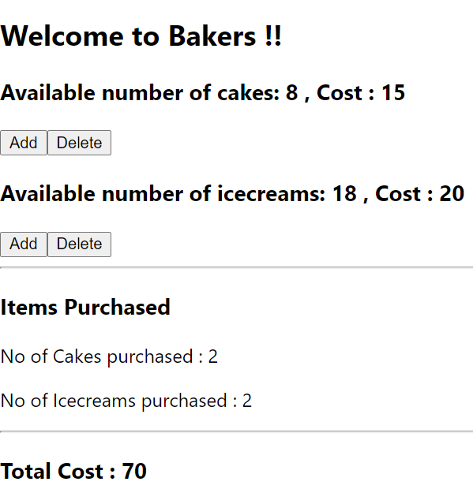

### Day 38
---
In this challenge you are going to print the total cost of each variety that you have bought from the bakery.

#### Functionalities 
We should be able to see the totak cost of items that we have purchased in our cart.

#### Code requirements
1. Create variable in state that for the total cost.
2. After each add or delete the total cost should be updated.
2. Display the total cost.

#### Output should look like
1. ##### Display 

2. ##### After adding 2 cakes and 2 icecreams

3. ##### After deleting one icecream from the cart
