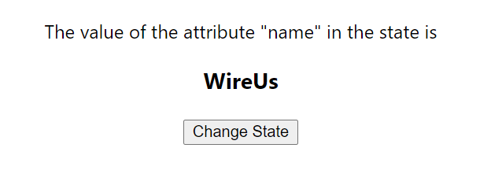
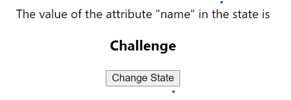

### Day 11
---
In this challenge you change the state of the component

#### Functionalities 
1. Contains a button which handles event onClick
2. On the button click the state of the component should be changed

#### Code requirements
1. Create a class component with state as "name" as your name initially.  
2. On the button click, the state should be set as your friend's name using "setState"

#### Output should look like

