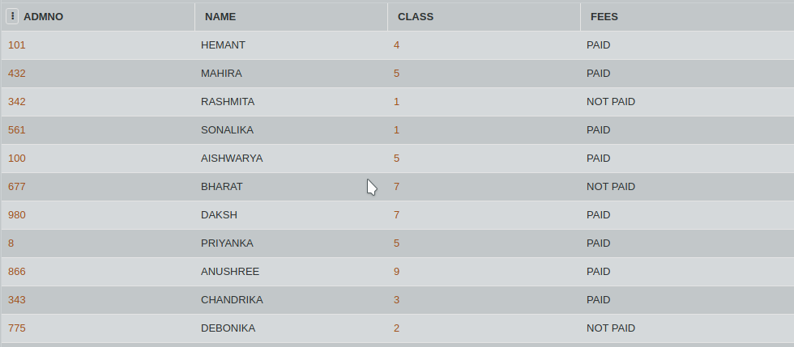

## SQL Challenge - Deletion Day

The office administrator of the school has created a database system consisting the details of all the students (admission number, name etc) . While entering the details, he seemed to have entered some duplicate records with a wrong admission number. Only 3 digit admission numbers are considered to be valid. We need to remove all the records from the table whose ADMNO is not a 3 digit number.

Consider the table FEES. Write a SQL command to delete those records which has ADMNO less than 100(not a 3 digit number).

#### Table: Fees

