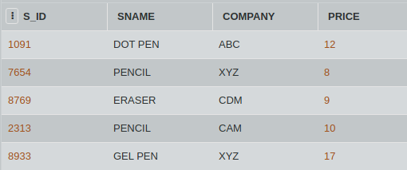

## SQL Challenge - Price Problem
## DAY SIXTEEN 
## Challenge Master - Aishwarya 

You are the new manager of the Stationery store. Looking at the prices, you realise that to increase the profits, you need to increase the prices by 5 rupees.

Consider the table STATIONERY given below. Write an SQL query to update the PRICE column by increasing the values by 5.

#### Table: STATIONERY

