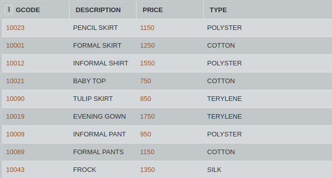
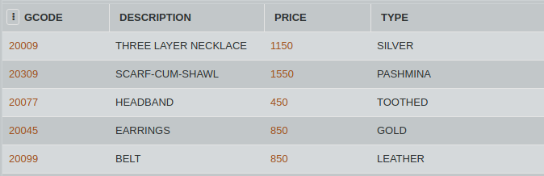

## SQL Challenge - Let's Unionize

Valerie and her niece merged their mini clothing and accesories stores to create one big all-in-one shop. Since they are merging, they want to combine their individual databases to compare prices.

Consider the tables GARMENT and ACCESSORIES. Write an SQL query to combine the two tables row-wise, and arrange the PRICE column in accordance to increasing prices.

#### Table: GARMENT

#### Table: ACCESSORIES

