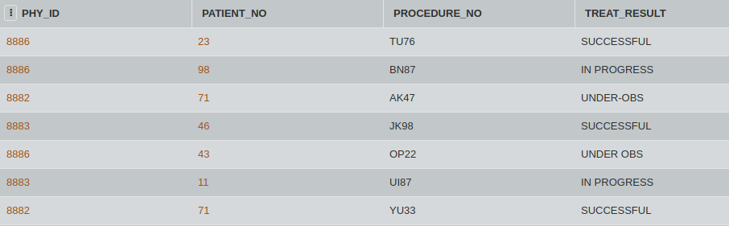

## SQL Challenge - Clinic Case
## DAY TWENTY ONE 
## Challenge Master - Aishwarya 

You are the new head nurse at the neuro-department of the hospital. You need to check on some particular patient treated by three doctors.

List the patients who had either D. Pandya, Dr. Sapra, Dr. Rashid or Dr. Jon as their physicians. [Dr. Pandya has a physician id as 8883, Dr. Sapra has a physician id as 8887, Dr. Rashid has a physician id as 8886, Dr. John has a physician id as 8882] .

#### Table: TREATS

