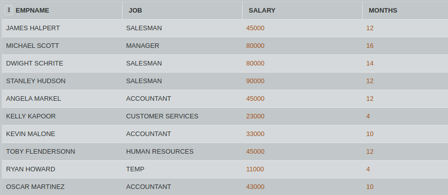

## SQL Challenge - The Office

Jo from Sabre, wants to find out who has the maximum earnings in the Scranton branch. Earnings can be denoted as months X salary.

Write a query to find the maximum total earnings for all employees as well as the total number of employees who have maximum total earnings. Then print these values as  space-separated integers.

#### Table: JOBS

