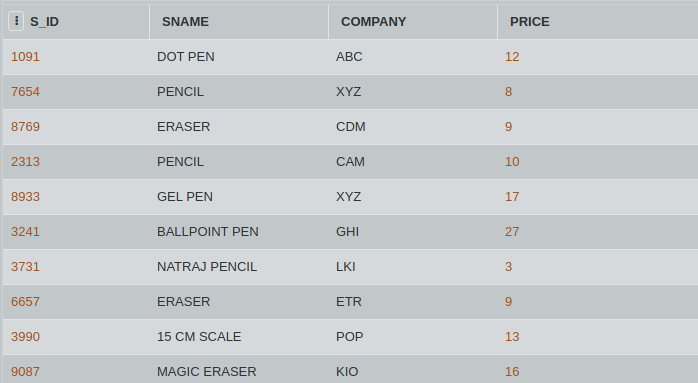

## SQL Challenge - Company Cancellation

You re the new manager of the Stationery store. Looking at the table you realise, there is an unneccassary column 'COMPANY' in the database.

Consider the table STATIONERY given below. Write an SQL query to update the table by deleting the column COMPANY from the table.

#### Table: STATIONERY

