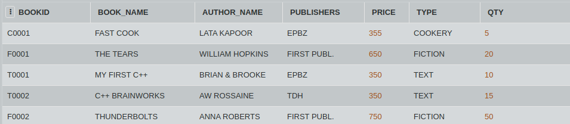
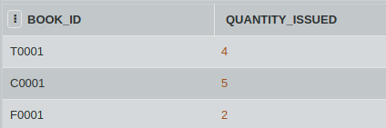

## SQL Challenge - What's the output(1)

Give the ouput of the following queries based on the above tables:

- SELECT COUNT(*) FROM BOOKS;

- SELECT MAX(PRICE) FROM BOOKS WHERE QUANTITY >= 15;

- SELECT BOOK_NAME, AUTHOR_NAME FROM BOOKS WHERE PUBLISHERS = "EPBZ";

- SELECT COUNT (DISTINCT PUBLISHERS) FROM BOOKS WHERE PRICE >= 400;
