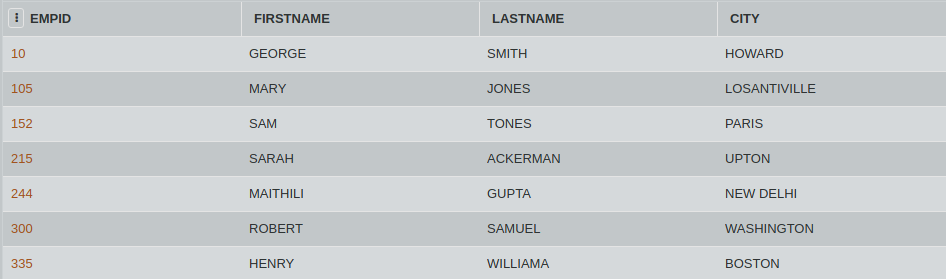
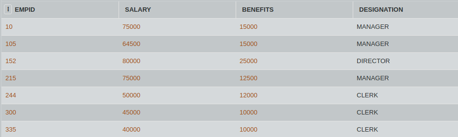

## SQL Challenge: Salary Time
## DAY THIRTY ONE 
## Challenge Master - Aishwarya 

It is the month end and the employees are expecting their salary sheet.

Write an SQL query to display Firstname, Lastname and Total Salary of all Managers from the table Employees and Empsalary, where Total Salary is calculated as Salary + Benefits.

#### Table: Employees

#### Table: Empsalary

