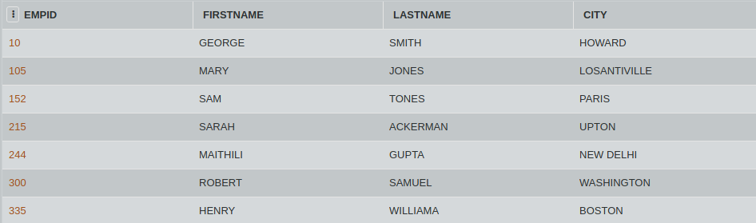
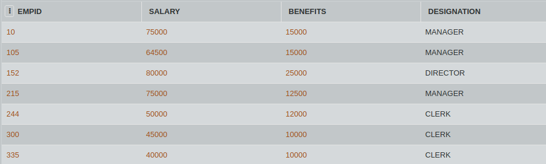

## SQL Challenge: Salary Time (Output)

#### Table: Employees

#### Table: Empsalary

Give outputs for the following SQL queries:

- SELECT FIRSTNAME, SALARY
  FROM EMPLOYEES, EMPSALARY
  WHERE DESIGNATION = "CLERK" AND
  EMPLOYEES.EMPID=EMPSALARY.EMPID;
  
- SELECT COUNT(DISTINCT DESIGNATION) FROM EMPSALARY;

- SELECT DESIGNATION, SUM(SALARY)
  FROM EMPSALARY
  GROUP BY DESIGNATION HAVING COUNT(*) > 2;
  
- SELECT SUM(BENEFITS)
  FROM EMPLOYEES
  WHERE DESIGNATION = "CLERK";
