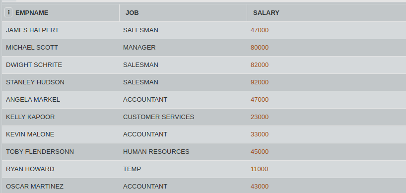

## SQL Challenge - TOP 3 EMPLOYEES

David Wallace has sent you from the corporate to Dunder Mifflin Scranton branch to get find out who are the top 3 employees in the branch. This can be decided on the basis of which three employees are paid the most. 

Consider the table JOBS. Write an SQL query to display the names of the employees and the salary of top 3 employees from table JOBS.

#### Table: JOBS

