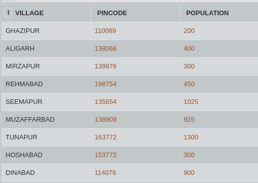

# SQL Challenge- The Postman Problem
# DAY FOUR
# Challenge Master - Aishwarya 

Govind is appointed as the new postman in the town. Being new to this job, he is really confused about the area he needs to deliver the letters at. Help Govind find his areas of delivery. Areas with pincode starting from ‘13’ are his areas of delivery with a population of less than 1000.

In this question, display all details from the table PINCODE where PINCODE starts with ‘13’ and POPULATION <= 1000.

#### Table: PINCODE

