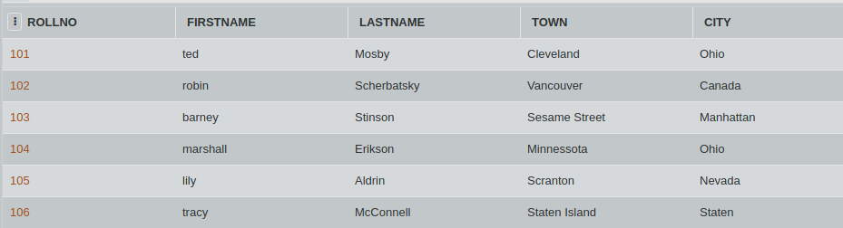

SQL Challenge - Name them Up

Consider the table CLASS_A. Write an SQL query to convert the firstname column into uppercase and then concatenate address and city. 
(HINT: Use UPPER() command)

#### Table: CLASS_A

)
