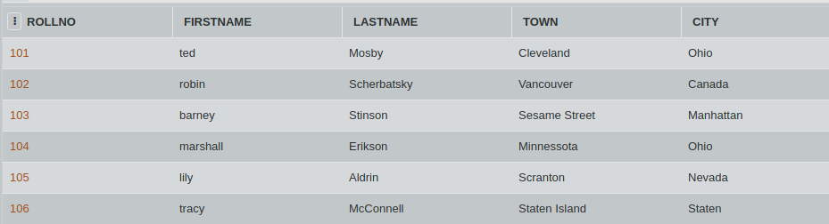

## SQL Challenge - Create Code

The newly proposed school norm suggest that each student must have an unique identification code. A unique identification code is made by the first three letters of the name + the student's roll no.

Suppose, the student's name is Jeanette and rollno 230, her unique code would be jea230.

Consider the table CLASS_A. Write an SQL query to select the first three letters of the name from the column FIRSTNAME and concatenate it with their rollnos. 
(HINT: Use SUBSTR() command)

#### Table: CLASS_A

)
