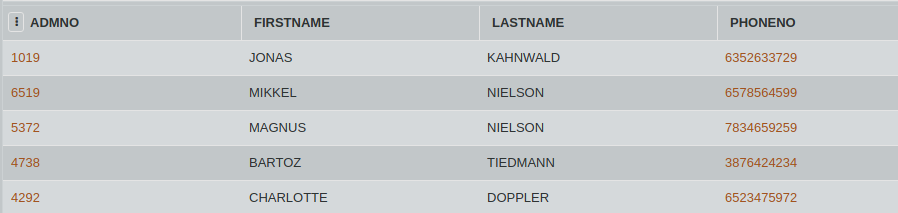

## SQL Challenge - Lets Remove Spaces

The class monitor was given the responsibility of entering the names in the database. By mistake he added a few spaces before entering the first name.
E.g - Name "Hannah" was entered as "   Hannah".
      (extra spaces before Hannah)
      
Consider the table CLASS. Write an SQL query to remove the spaces from the left side of the string in the column FIRSTNAME.

#### Table: CLASS

