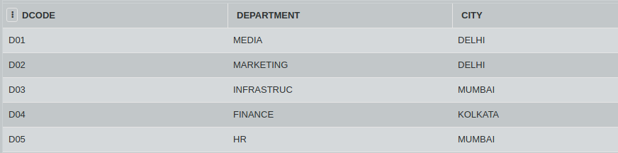
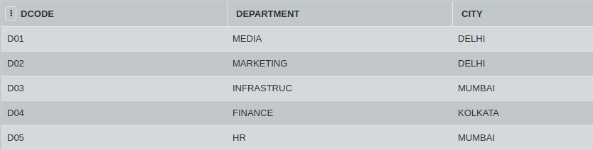

## SQL Challenge - Whats the output

#### Table: DEPT

#### Table: WORKER

Find outputs for the SQL queries given below:

- SELECT COUNT(*), DCODE FROM WORKER
  GROUP BY DCODE HAVING COUNT(*) > 1;
  
- SELECT DISTINCT DEPARTMENT FROM DEPT;

- SELECT NAME, DEPARTMENT, CITY 
  FROM WORKER W, DEPT D
  WHERE W.DCODE = D.DCODE AND WNO < 1003;
  
- SELECT MAX(DOJ0, MIN(DOJ)
  FROM WORKER
