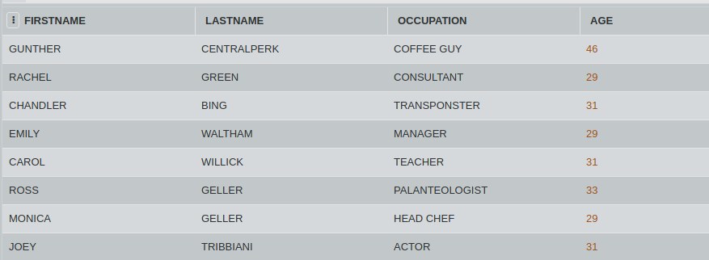

 
## SQL Challenge - Who's Left

Rachel, Phoebe, Monica, Chandler, Joey and Ross are the regulars at the coffee house, Centrel Perk. The table CENTREL_PERK contains the information about all the people who visit the coffee house daily. 

Consider the table CENTREL_PERK and FRIENDS. Write an SQL query to show the records from the table CENTREL_PERK that are not present in FRIENDS.

#### Table: CENTREL_PERK

#### Table: FRIENDS

